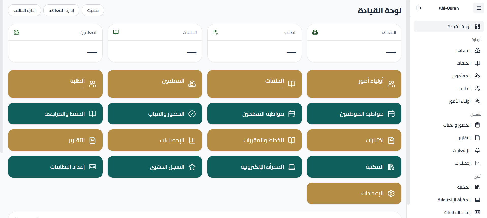

# 📖 AhlQuran – Quran Circles Management Platform

A backend-first SaaS platform designed to manage Quran memorization circles with a clean, scalable, and maintainable architecture.

AhlQuran focuses on real-world business logic, role-based access control, and system design — not just CRUD operations.

---

## 🎯 Project Purpose
AhlQuran helps educational institutes manage their Quran programs by providing:

- Student & teacher management
- Quran circles organization and scheduling
- Attendance and memorization progress tracking
- Secure, role-based access control

Built as a **production-oriented education SaaS**, not a demo project.

---

## 🧠 Core Features
- Multi-role system (Admin / Teacher / Student)
- Circle creation, scheduling, and assignment
- Attendance tracking with extensible data model
- Policy & Gate-based authorization
- Clear separation between business logic and controllers

---

## 🏗 Architecture & Design
- Service Layer to encapsulate business logic
- Policy-driven authorization flow
- RESTful, API-ready backend structure
- Scalable relational database design
- Clean, maintainable Laravel architecture following SOLID principles

---

## 🛠 Tech Stack
- **Backend:** Laravel 10+, PHP 8+
- **Database:** MySQL
- **Authentication & Authorization:** Laravel Auth, Policies, Gates
- **Frontend:** Blade (API-ready for React or Vue)
- **Testing:** PHPUnit (structure prepared)

---

## 📸 Screenshots
> Current state of the system (UI and core flows)

---

## 🚀 Roadmap & Future Enhancements
- Full API-first separation
- Dedicated React dashboard
- Advanced attendance & progress analytics
- Multi-institute SaaS architecture
- Performance optimization & caching layer

---

## 👨‍💻 Author
**Mohammed Al-Swaisy**  
Senior Backend Engineer | SaaS Architect  

🔗 LinkedIn: https://www.linkedin.com/in/mohammed-swesy-0450a8272

> I don't just write code — I design backend systems that scale and make sense.
